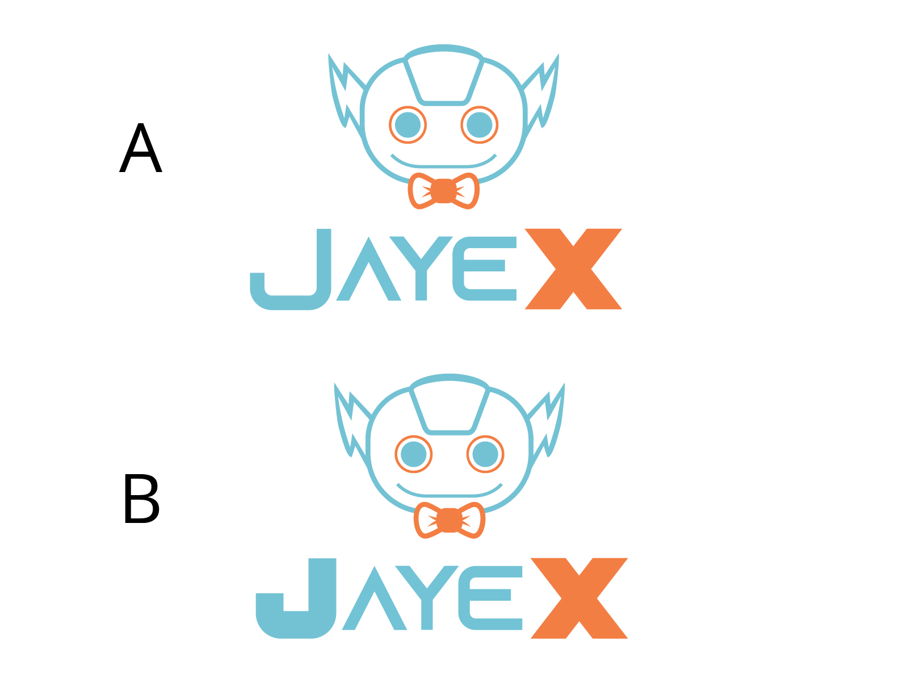

# Jenkins X Technical Oversight Committee (TOC) meeting December 10th 2025

## Participants

- Mårten Svantesson
- Archie Skeoch
- Jordan Goasdoué
- Gavin Kirwan

## Minutes

- Items to include in yearly report for CDF
 + Tekton upgrade
 + Name change
- Change project name to JayeX
  - Logotype variety A was selected 
  - New/updated web site
    - What to update apart from name:
      - Remove jx2 documentation
      - Remove outdated translations
      - Repalce Jenkins X with JayeX
  - Change name of organisations?
    - Some we lack ownership of, especially jenkins-x-terraform
    - When changing the name of an organisation references to repository related resources are redirected
    - Packages (ie OCI images) doesn't belong to repositories and are simply transfered to the new
      orgnanisation, The old references would not work anymore.
    - So organisations with packages that are in use should not have thir name changed.
   - When transferring single repositories to a new organisation old references aught to work for
    - release artifacts
    - go modules
    - helm charts (in gh-pages branch)
