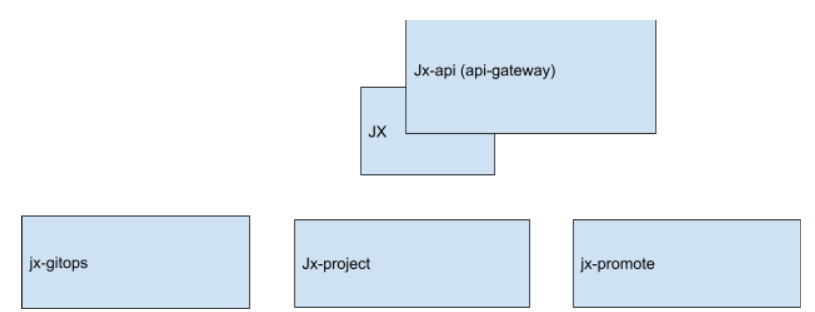

# Jenkins X UI SIG meeting notes

**April 22, 2022**

Participants:

- Ankit
- Tom

Agenda:

- Admin specific things

  - [Welcome to the Jenkins X community!](https://github.com/jenkins-x/jx-community)
  - Chair selection and term (quarterly rotation may be)
  - Repository set up: <https://github.com/jenkins-x/jx-ui>

- Tech stack

  - Backend: go
  - Frontend js: Sveltekit (or react/vue/angular)
  - RBAC: casbin (?)

- Initial feature list/requests
  - Feature parity with visualizer and compatibility (drop in replacement)
  - CRUD operations (Stop pipelines, start pipelines)
  - Import projects into JX using the UI
  - Audit logs
  - RBAC

Notes:

- First phase is feature parity with what we currently have:
  - Logs
  - Archived logs
  - Authorisation
  - Sorting based on branches / project

- Frontend testing to be done:
  - Preview Environment (actually views builds of that cluster)
  - UI Tests: Cypress, Selenium, Test Cafe
  - Unit Testing: Jest, React(?), Cucumber, Protractor
  - Lighthouse (google's thing)

- New API for jenkins x backend - CLI/UI will call this instead of doing all the work locally on their machine
- User voice to target most needed areas of development of the UI
- Feature list
  - Achieve feature parity then swap over the read only ui to the new one
  - Use the exact same URL so that users are not confused
  - RBAC (should make sure the initial structure is supportive of RBAC)

  - Wishlist:
    - Pipeline linting
    - Quickstart
    - Importing projects

- Few all of the archived pipelines (even the ones that have been garbage collected)

- Tech stack
  - Should have an evaluation step so we can see the different frameworks in action with the UI

- **How do we do operations within the cluster and within their scm provider but ensure that there is traceability and security to make sure users do not obtain more abilities (ie k8s, git) that violate their access rights?**

Actions:

- Vote on SIG head

- Ankit to push to jx-ui repo

- All contribute to get it imported and building

- Create the enhancement proposal within the enhancements repo

- Debate security for this project to ensure that it doesn't put any holes into jx
